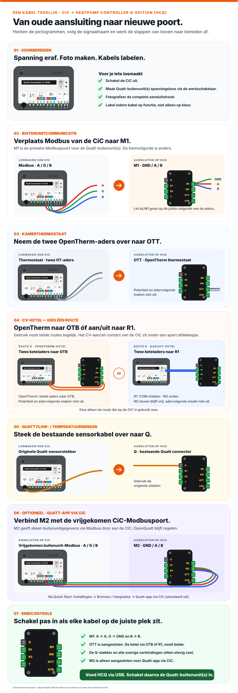

# Heatpump Controller Q-edition aansluiten en in gebruik nemen

Van nieuwe controller naar een werkende OpenQuatt-installatie. De Heatpump Controller Q-edition (HCQ) wordt standaard geleverd met `Single` + `Wi-Fi` voorgeïnstalleerd. Je brengt hem eerst online; de web-app begeleidt je daarna met de installatiekeuzes en eventuele wissel van opstelling of verbinding.

## De route in zes stappen

1. Maak de installatie spanningsloos en sluit de controller aan.
2. Stel Wi-Fi in via USB of het access point.
3. Open `openquatt.local`.
4. Kies in stap 1 van Quick Start de juiste setup.
5. Rond de overige Quick Start-stappen af.
6. Voeg OpenQuatt eventueel toe aan Home Assistant.

## 1. Controller aansluiten

Schakel eerst de CiC uit en maak alle Quatt-buitenunits spanningsloos, bijvoorbeeld met de werkschakelaar. Maak daarna een foto van de complete aansluitstrook en label de kabels voordat je iets losmaakt.

De HCQ neemt de signaalkabels van de CiC over. Sluit dezelfde kabel nooit tegelijk op de CiC en de HCQ aan.

### Interactief aansluiten: één stap tegelijk

Gebruik de foto van je eigen CiC als uitgangspunt. De stappenhulp toont steeds één grote stap. Kies een stap bovenaan of gebruik **Vorige** en **Volgende**.



### Welke kabel gaat waarheen?

| Van de CiC | Naar de HCQ | Zo sluit je aan |
|---|---|---|
| Buitenunit(s) · Modbus `A/G/B` | `M1` · `GND/B/A` | Let goed op de juiste volgorde: `A → A` (rood), `G → GND` (groen), `B → B` (blauw). |
| Kamerthermostaat · OpenTherm | `OTT` | Neem de twee aders over. |
| CV-ketel · OpenTherm | `OTB` | Neem de twee aders over. |
| CV-ketel · aan/uit | `R1` · `COM + NO` | Het CV-aan/uit-contact van de CiC zit onder een apart afdekkapje. `NC` blijft vrij. |
| Quatt flowmeter / PT1000 | `Q` | Steek de bestaande Quatt-sensorstekker over. |
| **Optioneel:** vrijgekomen buitenunit-Modbus `A/G/B` op de CiC | `M2` · `GND/B/A` | Gebruik een aparte RS485-kabel: `A → A`, `G → GND`, `B → B`. |

> [!NOTE]
> Bij de OpenTherm-verbindingen (`OTT` en `OTB`) en het aan/uit-contact (`R1`: `COM` + `NO`) maakt de polariteit of volgorde van de twee aders niet uit. Gebruik wel de genoemde aansluitklemmen.

> [!IMPORTANT]
> Kies voor de CV-ketel óf `OTB` óf `R1`; gebruik beide routes niet tegelijk. `T` is de losse Dallas/DS18B20-ingang en is niet de aansluiting voor de bestaande Quatt flowmeter/PT1000-kabel.

> [!TIP]
> De verbinding tussen `M2` en de CiC is optioneel. Activeer daarna **CiC-compatibiliteit** onder **Instellingen → Bronnen / integraties** als de Quatt app via de CiC moet blijven meekijken. Deze functie staat standaard uit en geeft alleen OpenQuatt-data door; de CiC neemt de regeling niet over.

### Na het overzetten

Controleer in de laatste aansluitstap nog eenmaal `M1`, de gekozen ketelroute, de eventuele `M2`-verbinding en alle stekkers. Sluit daarna de USB-voeding aan op de USB-poort van de HCQ. Schakel vervolgens de Quatt-buitenunit(s) weer in, bijvoorbeeld met de werkschakelaar.

Laat de USB-poort bereikbaar. Je hebt deze later ook nodig voor Wi-Fi provisioning, een firmwarewissel of herstel.

## 2. Wi-Fi instellen

Een Wi-Fi-build biedt twee routes. Probeer eerst provisioning via USB; gebruik het OpenQuatt access point als fallback.

### Route A: via USB

Deze route schrijft alleen de Wi-Fi-gegevens naar de controller en flasht geen nieuwe firmware.

1. Sluit de HCQ met een USB-datakabel aan op je computer.
2. Open de provisioningtool met de knop hieronder.
3. Klik op **Configureer Wi-Fi** en kies de USB-poort van de controller.
4. Vul de netwerknaam en het wachtwoord in.
5. Wacht tot de controller verbinding heeft en open daarna `http://openquatt.local`.

[Configureer Wi-Fi via USB](install/index.html#wifi-provision-panel)

Gebruik deze route ook als alleen de netwerknaam of het Wi-Fi-wachtwoord is gewijzigd.

### Route B: via het OpenQuatt access point

Kan de controller geen verbinding maken met het ingestelde Wi-Fi-netwerk, dan start een Wi-Fi-build een eigen access point met captive portal:

- netwerknaam: `OpenQuatt`;
- wachtwoord: `openquatt`.

1. Open de Wi-Fi-instellingen van je telefoon, tablet of computer.
2. Verbind met het netwerk `OpenQuatt`.
3. Vul het wachtwoord `openquatt` in.
4. Wacht tot de captive portal opent en kies daar je eigen Wi-Fi-netwerk.
5. Vul het Wi-Fi-wachtwoord in en laat de controller verbinden.
6. Verbind je telefoon of computer weer met je normale netwerk.
7. Open `http://openquatt.local`.

Verschijnt de captive portal niet? Blijf verbonden met `OpenQuatt` en open handmatig [http://192.168.4.1/](http://192.168.4.1/) in je browser.

> [!NOTE]
> Het access point is een tijdelijke configuratieroute en niet bedoeld als normale netwerkverbinding. Bij Ethernet is deze route niet beschikbaar.

## 3. OpenQuatt voor het eerst openen

Open na de netwerkverbinding:

```text
http://openquatt.local
```

Werkt deze naam niet, zoek dan het IP-adres van OpenQuatt in je router en open `http://<ip-adres>`.

Controleer voordat je verdergaat:

- de controller blijft online;
- de firmwareversie wordt getoond;
- warmtepompgegevens worden bijgewerkt;
- aanvoertemperatuur, flow en buitentemperatuur aannemelijke waarden tonen.

Zie [Web-app gebruiken](web-app.md) voor bediening, updates, backups en beveiliging.

## 4. Quick Start afronden

Quick Start verschijnt zolang de basisinstellingen nog niet zijn afgerond. De eerste stap is **Kies je setup**. De gemarkeerde kaart toont welke setup nu actief is; bij levering is dat normaal `Single · Wi-Fi`.

Kies hier direct de combinatie die bij je installatie hoort:

- `Single · Wi-Fi` of `Single · Ethernet` voor één warmtepomp;
- `Duo · Wi-Fi` of `Duo · Ethernet` voor twee warmtepompen.

Sluit bij Ethernet eerst de netwerkkabel aan. Kies alleen `Duo` als de installatie daadwerkelijk twee warmtepompen heeft.

Is je keuze anders dan de actieve setup, dan begeleidt de web-app de benodigde wissel vanuit Quick Start. Daarbij kan de controller andere firmware installeren en opnieuw opstarten. Je hoeft bij de eerste ingebruikname dus niet via **Instellingen → Systeem → Updates** te wisselen. Open na een herstart zo nodig opnieuw `http://openquatt.local` en ga verder met Quick Start.

Daarna geef je aan welke Quatt Hybrid en installatie je hebt. V1, V1.5 en V2 beschrijven de generatie van de warmtepomp en staan los van de keuze voor `Single` of `Duo`.

Volg de route die de web-app voor jouw installatie toont. De basisstappen zijn:

1. **Kies je setup:** `Single` of `Duo` en Wi-Fi of Ethernet.
2. **Kies je Quatt Hybrid:** V1, V1.5 of V2.
3. **Flowmeting configureren:** controleer en activeer de juiste flowbron.
4. **Thermostaatgegevens configureren:** kies waar kamertemperatuur en kamer-setpoint vandaan komen.
5. **CV-ketel of boiler:** geef aan of OpenQuatt deze als ondersteuning mag gebruiken.
6. **Kies de verwarmingsstrategie:** kies hoe OpenQuatt de verwarming regelt.
7. **Werk de regeling uit:** stel Power House of de stooklijn verder in.
8. **Flowregeling en afstelling:** leg vast hoe de pomp geregeld moet worden en welke waarden daarbij horen.
9. **Watertemperatuur beveiligen:** controleer de normale bovengrens en de tripgrens.
10. **Stille uren en niveaus:** stel het stille venster en de compressorlimieten voor dag en nacht in.
11. **Bevestigen en afronden:** controleer je keuzes en markeer Quick Start als voltooid.

## 5. Setup later wijzigen

Heb je Quick Start al afgerond en verandert de installatie later, dan kun je dezelfde setupwissel alsnog via de web-app starten. Maak eerst een backup.

Open in de web-app **Instellingen → Systeem** en kies bij **Updates** voor **Openen**. Onder **Geavanceerd** vind je, wanneer beschikbaar, **Opstelling wisselen** en **Verbinding wisselen**.

- Gebruik **Opstelling wisselen** om tussen `Single` en `Duo` te wisselen.
- Gebruik **Verbinding wisselen** om tussen Wi-Fi en Ethernet te wisselen. Sluit vóór een wissel naar Ethernet de netwerkkabel aan.
- Wijzig V1, V1.5 of V2 bij de installatie-instellingen; daarvoor is geen setupwissel nodig.
- Gebruik voor alleen een andere Wi-Fi-netwerknaam of een ander wachtwoord opnieuw **Configureer Wi-Fi via USB** of het OpenQuatt access point.

> [!IMPORTANT]
> Wi-Fi en Ethernet blijven aparte firmware-builds. Een Ethernet-build heeft geen Wi-Fi fallback of captive portal. De web-app voert zo'n wissel daarom uit als firmware-update en toont vooraf de bijbehorende controle.

## 6. Toevoegen aan Home Assistant

Home Assistant is optioneel. Zodra OpenQuatt en Home Assistant op hetzelfde netwerk zitten, wordt het ESPHome-apparaat meestal automatisch gevonden.

Gebruik de bestaande handleidingen voor de vervolgstappen:

- [OpenQuatt toevoegen en de eerste waarden controleren](installatie-en-ingebruikname.md#daarna-home-assistant)
- [Het juiste Single- of Duo-dashboard installeren](dashboard/README.md)
- [Het dashboard gebruiken](dashboardoverzicht.md)

Selecteer bij de eerste toevoeging nog geen Home Assistant-area. Wacht tot de OpenQuatt-entiteiten zijn aangemaakt en ken daarna pas een area toe.

## Als het niet lukt

- **Geen USB-poort zichtbaar:** controleer of je een USB-datakabel gebruikt en probeer een andere USB-poort.
- **Geen captive portal:** controleer dat je met `OpenQuatt` bent verbonden en dat je geen Ethernet-build gebruikt.
- **`openquatt.local` opent niet:** zoek het IP-adres in je router.
- **Geen warmtepompdata:** controleer voeding, communicatiebedrading en of `Single` of `Duo` klopt.
- **Niet gevonden in Home Assistant:** controleer eerst of de web-app lokaal bereikbaar is.

Ga voor verdere diagnose naar [Problemen oplossen](problemen-oplossen.md). Gebruik [Handmatige installatie](handmatige-installatie.md) alleen als de normale installer niet werkt.
